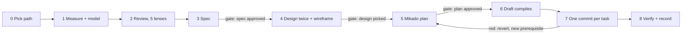

# Debt is measured, modelled, planned, then paid one commit at a time

> **Local notes.** If `~/.claude/skill-notes/debt-review.md` exists, read it before starting.
> It holds this user's own projects, exceptions and commands, and where it disagrees with this
> file, it wins.

Four rules decide most questions here.

**RANK BY COST, NEVER BY UGLINESS.** Most changes land in a few files. Debt in a file that
changed 400 times this half-year costs every one of those changes; the same debt in a file
untouched for a year costs nothing until someone opens it. CodeScene's guidance: low code
health in a hotspot is expensive, in stable code it has lower priority
(codescene.io/docs/guides/technical/hotspots.html).

**LESS TO KNOW, NOT FEWER LINES.** The test for every change: will the next person need to
hold less in their head to change this safely? A clever one-liner that replaces five plain
lines fails it. Deleting a wrapper nobody needs passes it.

**THE CODE EXPLAINS ITSELF; JSDOC DOCUMENTS THE CONTRACT.** Names and shape carry the
meaning. An exported symbol gets a JSDoc block a caller can use; a reason goes in `@remarks`;
history goes in the commit or the docs. An inline comment survives only for a hazard no name
can carry, in one short line. [references/jsdoc.md](references/jsdoc.md) has the convention.

**THE FLOOR IS NEVER CUT.** Validation at a trust boundary (user input, network, database rows,
another process), authorisation and security checks, protection against data loss,
accessibility affordances, and behaviour somebody asked for. Removing one is a behaviour change,
never a cleanup, however redundant it looks.

## The pipeline



| Path | When | Stages |
|---|---|---|
| A, answer | "how healthy is this?" | 0, 1, 2, report |
| B, small fix | one file or finding, effort S, no interface changes | 0, 1, 2, 7, 8 |
| C, full | interfaces change, several files, a hotspot split, effort M or L | all, three gates |

Say the path in one line at the start. The owner may raise it; it never drops mid-job. Every
stage writes one numbered file into the job folder ([references/pipeline.md](references/pipeline.md)
holds the spec and plan templates). Anything over 100 lines goes to a file, never into chat.

**THE REPO IS THE ONLY MEMORY EVERY SESSION SHARES.** Findings, plan and a kanban board
(`BOARD.md`) live in the job folder, committed and pushed, so any session on any account can
pick the job up at any moment. Every task commit carries the code, the card's move and a fresh
Handoff block together. Picking up: `git pull`, then
`bun ${CLAUDE_SKILL_DIR}/scripts/board.ts <job>/BOARD.md`, then pull the next card.
[references/tracking.md](references/tracking.md) has the board, the claim rule and the
handoff block.

Copy this checklist into your reply and tick items off:

```
- [ ] 0. git pull; existing BOARD.md read if any; path said; project rules read
- [ ] 1. measure.ts and model.ts run once; 01-current.md with diagrams
- [ ] 2. Five lenses run; findings verified; 02-findings.md ranked; BOARD.md backlog; pushed (A stops)
- [ ] 3. 03-spec.md written and self-reviewed              → GATE 1: owner approves
- [ ] 4. 04-target.md: 2-3 designs, wireframe, comparison  → GATE 2: owner picks
- [ ] 5. 05-plan.md: Mikado graph, tasks                    → GATE 3: owner approves
- [ ] 6. Draft committed: new interfaces compile, behaviour unchanged
- [ ] 7. Pull a card, claim, push; one commit per task with board + handoff; green (red: revert, return to 5)
- [ ] 8. Re-measured, re-modelled, guard rule added, decision recorded
```

An approval covers only what was shown at that gate. Never run past a gate on an earlier yes.

## 1. Measure and model

```bash
bun ${CLAUDE_SKILL_DIR}/scripts/measure.ts --out=<job>/measure [path...]
bun ${CLAUDE_SKILL_DIR}/scripts/model.ts --out=<job>/model --focus=<path> <root-folders...>
```

`measure.ts` writes `report.md`: hotspots (commits × lines), import cycles, unused files,
exports and dependencies, copy-paste clones, and functions over the limits. `model.ts` writes
Mermaid graphs of the packages and of the scope's neighbourhood. Both need only `git` and
`bun`; [references/tools.md](references/tools.md) lists what they run and what to do when a
number looks wrong. Run them ONCE and hand the output to every lens; lenses never run heavy
checks of their own.

Scope by request:

| Asked for | Scope |
|---|---|
| Review a change, a PR, "before I merge" | `git diff <base>...HEAD`, plus the files it touches |
| Clean up a folder, a module, a feature | that path |
| "The codebase", "optimise everything" | the top 10 to 20 hotspots, never the whole tree |

Then draw by hand what no tool can: a flowchart of each main flow through the scope, and a
state diagram wherever the code holds a real state machine. Rules for diagrams are in
[references/pipeline.md](references/pipeline.md).

## 2. Five lenses, in parallel

Spawn one subagent per lens. Pass each the FULL text of its prompt file (read it, do not
paraphrase), the scope, the report and model paths, the rules files, and
[references/conventions.md](references/conventions.md).

| Lens | Prompt | Finds |
|---|---|---|
| Structure | [references/lenses/structure.md](references/lenses/structure.md) | size, nesting, parameters, names, magic values, comments the code could say, shallow modules, cycles, divergent change |
| Duplication | [references/lenses/duplication.md](references/lenses/duplication.md) | one rule in two places, missed reuse, wrong abstractions, speculative generality |
| Dead code | [references/lenses/dead-code.md](references/lenses/dead-code.md) | unused code, flags that stopped deciding, stale words, needless guards |
| Types and state | [references/lenses/types-and-state.md](references/lenses/types-and-state.md) | type escapes, illegal states, redundant state, swallowed errors |
| Slop | [references/lenses/slop.md](references/lenses/slop.md) | model-written padding, defensive bloat, leftovers, verification theatre, test bloat |

Small scope (one file, a diff under ~300 lines): run the five prompts yourself in sequence.

Where each principle is checked:

| Principle | Lens |
|---|---|
| KISS | structure (layers, nesting), duplication (speculative generality), slop (premature structure) |
| DRY, rule of three, wrong abstraction | duplication |
| YAGNI | duplication, dead code (options nothing sets), slop (compatibility for nothing) |
| SOLID: single responsibility | structure (divergent change) |
| SOLID: open-closed | duplication (repeated switches) |
| SOLID: Liskov, interface segregation, dependency inversion | structure (shallow modules, dependency direction), duplication (one-implementation seams) |
| Command-query separation | types and state |
| Fowler's smells | across all five, by name |
| Readable code, JSDoc | structure, slop, against [references/jsdoc.md](references/jsdoc.md) |

The principles, with sources and the cases where each is WRONG:
[references/principles.md](references/principles.md). The numeric limits and TypeScript rules:
[references/conventions.md](references/conventions.md).

### Verify every finding

A lens reports leads. Before a finding enters the table, open the code and confirm it:

- **"Unused"**: search the whole repo for the name as a string too (routes, RPC and SQL names,
  i18n keys, computed imports, scripts, other apps, older clients in the field). Use
  `blast-radius` if the project has it.
- **"Duplicate"**: name the single rule both copies encode. No rule: they only look alike.
- **"Too big"**: name the two reasons it changes. One reason: size alone is not a finding.
- **"Redundant guard"**: prove untrusted data cannot reach it. If it can, it is the floor.
- **Against the rules**: if a project rule endorses it, drop it.

Drop what fails. Keep what you could not check, marked UNSURE, at the bottom.

### Rank

`02-findings.md`, most expensive first:

| # | Where | Finding | Principle | Fix | Cost to keep | Hotspot rank | Effort |
|---|---|---|---|---|---|---|---|

**Cost to keep** is concrete ("every new tender type edits these three switches"), never
"hurts readability". **Effort** is S (one commit), M (a few commits) or L (needs path C).
Order by cost × hotspot rank, then effort. Show the top of the table in the reply.

## 3 to 8. Spec, design, plan, draft, execute, verify

Path C only, except 7 and 8, which path B also runs. The detail and templates are in
[references/pipeline.md](references/pipeline.md). The rules that matter:

- **Spec before design.** What must not change is written down, with the test that pins it.
- **Design twice.** At least two target shapes, each with a module diagram, a wireframe of
  exported signatures with JSDoc (no bodies), and a sequence diagram of the flows that cross
  new seams. Delete any module that fails the deletion test, and any seam with one
  implementation.
- **Plan backwards** with a Mikado graph; leaves first; one commit per task; at most about
  five files per task; every file marked `[NEW]`, `[MODIFY]` or `[DELETE]`.
- **Draft first.** The wireframe goes into the repo as compiling files that delegate to the
  old code, before anything moves.
- **One task, one commit, shape only.** A bug found is its own commit. Pin behaviour with a
  test before changing it. Green after every step; red means revert and add a prerequisite.
  Delete the old shape once nothing reaches it. Never start a sweep the owner did not ask for.
  Use the project's `refactor` skill where it has one.
- **Verify and lock in.** Re-measure and re-model; set the new diagrams beside the target;
  add a lint or dependency-cruiser rule forbidding the old import direction; record the
  decision where the project keeps its rules. Never report a quality score.

## Thresholds

Defaults, overridden by the project's lint config; `measure.ts` uses these:

| Measure | Flag above | Source |
|---|---|---|
| Function length | 50 lines | ESLint `max-lines-per-function` default; Everything Claude Code |
| File length | 800 lines without a stated reason | Everything Claude Code |
| Cyclomatic complexity | 20 | ESLint `complexity` default |
| Cognitive complexity | 15 | `sonarjs/cognitive-complexity` default |
| Nesting depth | 4 | ESLint `max-depth` default |
| Parameters | 4 | ESLint `max-params` defaults to 3; 4 leaves room for an options object |
| Clone | 50 tokens and 5 lines | jscpd `--min-tokens` / `--min-lines` |

A threshold opens a question; the finding is the answer to it.

## When NOT to

| Looks like debt | Leave it |
|---|---|
| Two similar blocks encoding different rules | they will change apart; merging couples them |
| A long file that is data (catalogues, manifests, test tables, migrations) | size is its job |
| A seam with a test adapter and a real one | two adapters make it a real seam |
| A guard at a trust boundary | the floor |
| Code nobody will change this year | cost is near zero; note it, fix nothing |
| A rewrite that "would be cleaner" | a rewrite is a project: path C, proposed separately |
