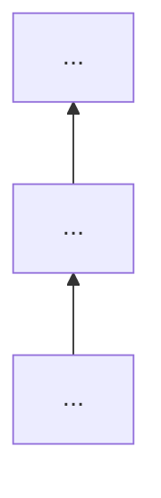

# The pipeline in detail

## Contents
- Where the files go
- Stage 0: pick the path
- Stage 1: measure and model the current structure
- Stage 2: review
- Stage 3: spec
- Stage 4: design it twice
- Stage 5: plan
- Stage 6: draft
- Stage 7: execute
- Stage 8: verify and record
- Diagram rules
- Templates

## Where the files go

The job folder, the board and the handoff are in [tracking.md](tracking.md). Each stage
writes one numbered file there and pushes it, so the next stage, a reviewer, or another
session after a hard stop picks up from the repo. Anything over 100 lines goes to a file,
never into chat; chat gets the path and the decision needed.

## Stage 0: pick the path

| Path | When | Stages |
|---|---|---|
| A, answer | a question about the code's health | 1 and 2, then report |
| B, small fix | one file or one finding, effort S, no interface changes | 1, 2, 7, 8 |
| C, full | anything touching an interface, several files, a hotspot split, or effort M/L | all, with the three gates |

Say the path in one line. The owner may move it up; it never moves down mid-job.

## Stage 1: measure and model the current structure

Run `measure.ts` and `model.ts` ([tools.md](tools.md)). Write `01-current.md` holding:

- the hotspot table and the report's totals;
- `packages.mmd`: one box per package or app, arrows for imports, generated;
- `focus.mmd`: the files in the scope and their direct neighbours, generated;
- the import cycles touching the scope;
- a **flowchart** of each main flow through the scope (entry → decisions → effects), drawn by
  hand from reading the code;
- a **state diagram** wherever the code holds a real state machine (an order's status, a
  booking's life), drawn from the code's own status values.

Every diagram's first line is a `%%` comment naming the command, or the files read, and the
commit it reflects.

## Stage 2: review

The five lenses run against the scope (SKILL.md step 4). Verified findings go into
`02-findings.md` as the ranked table. Path A stops here.

## Stage 3: spec

`03-spec.md` (template below): the problem in the owner's words, the outcome, the behaviour
that must not change, the invariants, what is out of scope, and how the result will be
checked. Self-review it for placeholders, contradictions and anything two readers could take
two ways.

**Gate 1: the owner approves the spec.** An approval covers only what was shown.

## Stage 4: design it twice

Draw the target at least two ways, ideally three, each under a different pull: smallest
interface; easiest for the most common caller; the shape the codebase already uses elsewhere.
Spawn one subagent per design when the scope is large. Each design gives:

- a target module diagram (`flowchart`) with the allowed import direction;
- the **wireframe**: every new or changed module's exported signatures with their JSDoc
  summaries, no bodies, as a `classDiagram` or a TypeScript block;
- a `sequenceDiagram` for the one or two flows that cross the new seams;
- what each module hides, and what the old shape's callers must change.

Compare the designs in a table: interface size, what moves, what callers change, risk. Apply
the deletion test to every new module, and drop any seam with only one implementation.
`04-target.md` holds all designs, the comparison and a recommendation.

**Gate 2: the owner picks a design.**

## Stage 5: plan

Work backwards from the target with a Mikado graph: the goal at the top, and under it each
change that must happen first. Try the goal; whatever breaks becomes a prerequisite; revert;
repeat until the leaves can be done without breaking anything. Draw it as `flowchart BT`.

`05-plan.md` (template below) turns the leaves-first order into tasks. Each task is one
commit that keeps the build and tests green, touches at most about five files, and has no
"and" in its title. Mark every file `[NEW]`, `[MODIFY]` or `[DELETE]`. A checkpoint (full
scoped checks, a look at the diagrams) every two or three tasks.

For a huge file use branch by abstraction: put the new module's interface in front, move the
callers to it, move the body behind it, delete the old copy. The build stays green at every
step. For a wide rename, expand then contract: add the new name, move callers, remove the old.

**Gate 3: the owner approves the plan.**

## Stage 6: draft

Write the wireframe into the repo: the new files with their exported signatures and JSDoc,
each body delegating to the existing code. It compiles and changes no behaviour. This is the
first commit, and it proves the target interfaces type-check before any code moves.

## Stage 7: execute

Task by task, in plan order:

1. Read the task; check its "blocked by" tasks are done.
2. Make the change. Shape only (a bug found is its own commit, before or after).
3. Run its verification command and read the output.
4. Green: commit with the task's message. Red: revert, write the new prerequisite into the
   plan, return to stage 5 for that branch of the graph.

The board tracks every task (tracking.md). Where reality forces a change to the plan, write a
`Ruling:` line under the task in `05-plan.md` in the same commit.

## Stage 8: verify and record

Re-run `measure.ts` and `model.ts`. `08-verify.md` sets the new diagrams beside the target and
the numbers beside stage 1's. Then make the target permanent:

- a dependency-cruiser rule (or the project's lint) that forbids the old import directions, so
  the structure cannot drift back;
- the architecture decision in the project's docs (the one-line rule where the project keeps
  rules, the account in its docs), so the next plan starts from it.

## Diagram rules

- Mermaid in fenced `mermaid` blocks; GitHub renders them in Markdown files, issues and PRs.
- Names in diagrams are the names in the code: file paths, function names, status values.
- Generated diagrams are regenerated, never edited by hand.
- One idea per diagram; split past about 30 nodes.
- Prefer `flowchart`, `classDiagram`, `sequenceDiagram` and `stateDiagram-v2`; Mermaid's C4
  syntax is still marked experimental.

## Templates

### 03-spec.md

```markdown
# <job>: spec
Path: C. Commit: <sha>.

## Problem
<the owner's words, then one paragraph of what the measurements show>

## Outcome
<what is true when this is done, checkable>

## Must not change
- <behaviour, with the test that pins it, or "test to write: …">

## Invariants
- <rules from the project that this work touches>

## Out of scope
- <…>

## How we will know
- <commands and the numbers they must show>
```

### 05-plan.md

```markdown
# <job>: plan
Goal: <one sentence>. Spec: 03-spec.md. Design: 04-target.md option <X>.

## Constraints
<exact values copied from the spec>

## Mikado graph


## Tasks
### T1 <title, no "and">
- Blocked by: none
- Files: [NEW] path, [MODIFY] path:lines, [DELETE] path
- Interfaces: consumes `…`, produces `…`
- Done when: <at most three checks>
- Verify: `<command>` → <expected>
- Revert if: <what red means>
- Commit: <message>

```
